# JODI Onboarding Flow — Conditional Logic Map

**Current State:** 77 questions across 8 sections with conditional skip logic

---

## Visual Flow Diagram

```mermaid
flowchart TD
    Start([START]) --> Intro[Intro Messages 1-7]
    Intro --> A1[Q1: Gender]
    
    %% SECTION A: IDENTITY & BASICS (Q1-Q9)
    A1 --> A2[Q2: First Name]
    A2 --> A3[Q3: Date of Birth]
    A3 --> A4[Q4: Marital Status]
    
    A4 -->|Never married| A6[Q6: Height]
    A4 -->|Divorced/Widowed/Separated| A5[Q5: Children from previous]
    A5 --> A6
    
    A6 --> A7[Q7: Body Type]
    A7 --> A8[Q8: Complexion]
    A8 --> A9[Q9: Disability]
    
    %% SECTION B: LOCATION & MOBILITY (Q10-Q17)
    A9 --> B10[Q10: Residency Type]
    
    B10 -->|NRI/OCI| B11[Q11: Country Current]
    B10 -->|Indian in India| B12[Q12: State India]
    
    B11 --> B13[Q13: City Current]
    B12 --> B13
    B13 --> B14[Q14: Hometown]
    B14 --> B15[Q15: Open to Relocating]
    B15 --> B16[Q16: Partner Location Pref]
    
    B16 -->|NRI/OCI| B17[Q17: Visa Status]
    B16 -->|Indian in India| C18[Q18: Religion]
    B17 --> C18
    
    %% SECTION C: RELIGION & CULTURE (Q18-Q27)
    C18 --> C19[Q19: Religious Practice]
    C19 --> C20[Q20: Partner Religion Pref]
    C20 --> C21[Q21: Sect/Denomination]
    
    C21 -->|Hindu/Jain/Sikh/Buddhist| C22[Q22: Caste/Community]
    C21 -->|Muslim/Christian/etc| C25[Q25: Mother Tongue]
    
    C22 -->|Answered| C23[Q23: Sub-caste/Gotra]
    C22 -->|Prefer not to say| C25
    C23 --> C24[Q24: Caste Importance]
    
    C24 -->|Hindu/Jain| C27[Q27: Manglik Status]
    C24 -->|Other| D28[Q28: Education Level]
    C27 --> D28
    C25 --> C26[Q26: Languages Spoken]
    C26 --> D28
    
    %% SECTION D: EDUCATION & CAREER (Q28-Q32)
    D28 --> D29[Q29: Institute Tier]
    D29 --> D30[Q30: Employment Status]
    D30 --> D31[Q31: Industry]
    D31 --> D32[Q32: Career Ambition]
    
    %% SECTION E: FINANCIAL (Q33-Q37) — PRIVATE
    D32 --> E33[Q33: Income Range 🔒]
    
    E33 -->|NRI| E34[Q34: Income Currency 🔒]
    E33 -->|India| E35[Q35: Net Worth 🔒]
    E34 --> E35
    
    E35 --> E36[Q36: Property Ownership 🔒]
    E36 --> E37[Q37: Financial Dependents 🔒]
    
    %% SECTION F: FAMILY (Q38-Q44)
    E37 --> F38[Q38: Family Type]
    F38 --> F39[Q39: Family Financial Status]
    F39 --> F40[Q40: Father Occupation]
    F40 --> F41[Q41: Family Values]
    F41 --> F42[Q42: Living with Parents Post-Marriage]
    F42 --> F43[Q43: Family Involvement]
    F43 --> F44[Q44: Siblings]
    
    %% SECTION G: LIFESTYLE (Q45-Q55)
    F44 --> G45[Q45: Diet]
    G45 --> G46[Q46: Partner Diet Pref]
    G46 --> G47[Q47: Smoking]
    G47 --> G48[Q48: Partner Smoking Pref]
    G48 --> G49[Q49: Drinking]
    G49 --> G50[Q50: Partner Drinking Pref]
    G50 --> G51[Q51: Fitness Routine]
    G51 --> G52[Q52: Social Style]
    G52 --> G53[Q53: Weekends]
    G53 --> G54[Q54: Pets]
    G54 --> G55[Q55: Sleep Schedule]
    
    %% SECTION H: PARTNER PREFERENCES (Q56-Q64)
    G55 --> H56[Q56: Partner Age Range]
    H56 --> H57[Q57: Partner Height Pref]
    H57 --> H58[Q58: Partner Complexion Pref]
    H58 --> H59[Q59: Partner Education Min]
    H59 --> H60[Q60: Partner Income Pref]
    H60 --> H61[Q61: Partner Marital History OK]
    H61 --> H62[Q62: Partner Children OK]
    H62 --> H63[Q63: Partner Disability OK]
    H63 --> H64[Q64: Interfaith/Intercaste OK]
    
    %% SECTION I: VALUES & DEALBREAKERS (Q65-Q72)
    H64 --> I65[Q65: Politics]
    I65 --> I66[Q66: Children Intent]
    
    I66 -->|Definitely not| I68[Q68: Long-term Goals]
    I66 -->|Want kids| I67[Q67: Children Timeline]
    I67 --> I68
    
    I68 --> I69[Q69: Deal with Conflict]
    I69 --> I70[Q70: Emotional Availability]
    I70 --> I71[Q71: Love Language]
    I71 --> I72[Q72: Non-Negotiables]
    
    %% SECTION J: PHOTOS & COMPLETION
    I72 --> J73[Q73-Q77: Dealbreaker Prefs]
    J73 --> Photos[Photo Upload Request]
    Photos --> Complete([COMPLETE])
    
    %% STYLING
    classDef section fill:#e1f5ff,stroke:#0066cc,stroke-width:2px
    classDef conditional fill:#fff3cd,stroke:#ff9800,stroke-width:2px
    classDef private fill:#ffe6e6,stroke:#d32f2f,stroke-width:2px
    
    class A1,A2,A3,A4,A5,A6,A7,A8,A9 section
    class B10,B11,B12,B13,B14,B15,B16,B17 section
    class C18,C19,C20,C21,C22,C23,C24,C25,C26,C27 section
    class D28,D29,D30,D31,D32 section
    class E33,E34,E35,E36,E37 private
    class F38,F39,F40,F41,F42,F43,F44 section
    class G45,G46,G47,G48,G49,G50,G51,G52,G53,G54,G55 section
    class H56,H57,H58,H59,H60,H61,H62,H63,H64 section
    class I65,I66,I67,I68,I69,I70,I71,I72 section
    
    class B10,C21,C22,C24,I66 conditional
```

---

## Conditional Logic Summary

| Question | Condition | Skip If |
|----------|-----------|---------|
| **Q5** (Children from previous) | Show if marital_status ≠ "Never married" | Never married |
| **Q11** (Country) | Show if residency ≠ "Indian in India" | Indian in India |
| **Q12** (State India) | Show if residency = "Indian in India" | NRI/OCI |
| **Q17** (Visa Status) | Show if NRI/OCI | Indian in India |
| **Q22-Q24, Q27** (Caste/Sub-caste/Manglik) | Show if Hindu/Jain/Sikh/Buddhist | Muslim/Christian/etc |
| **Q23** (Sub-caste) | Show if Q22 answered (not "Prefer not to say") | Not answered |
| **Q34** (Income Currency) | Show if NRI | Indian in India |
| **Q67** (Children Timeline) | Show if children_intent ≠ "Definitely not" | Definitely not |

---

## Section Jump Logic

| From | To | Condition |
|------|----|-----------| 
| Q21 | Q25 | If Q22 (caste) should be skipped (religion not Hindu/Jain/Sikh/Buddhist) |
| Q24 | Q28 | If Q27 (manglik) should be skipped (religion not Hindu/Jain) |
| Q16 | Q18 | If Q17 (visa) should be skipped (not NRI/OCI) |

---

## Question Count by Path

| User Type | Questions Asked | Skipped |
|-----------|----------------|---------|
| **Hindu, Never Married, India** | 73 | 4 (Q5, Q11, Q17, Q34) |
| **Muslim, Never Married, India** | 69 | 8 (Q5, Q11, Q17, Q22-Q24, Q27, Q34) |
| **NRI Hindu, Never Married** | 73 | 4 (Q5, Q12, varies) |
| **Divorced Hindu with Kids, India** | 74 | 3 (Q11, Q17, Q34) |

---

## Known Issues

1. **Q26 (Languages)** — Reported loop (appearing multiple times)
2. **No section transitions** — Abrupt jumps between categories
3. **Conditional options** — Q21 (sect) and Q22 (caste) fixed, but need cultural terminology review
